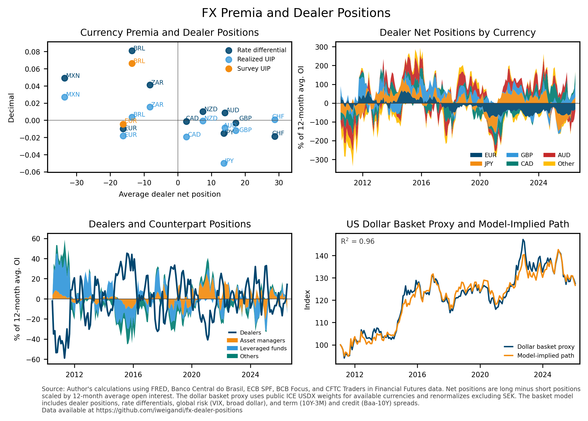

# FX Currency Premia and Dealer Positions

This repository builds a compact public-data panel linking currency premia, short-rate differentials, and dealer positioning in FX futures markets.

The project focuses on open-data indicators that can be updated automatically:

- monthly currency excess returns against the US dollar,
- foreign-US short-rate differentials,
- dealer net positions from CFTC Traders in Financial Futures reports, scaled by a 12-month average of open interest,
- participant-position decompositions for dealers, asset managers, leveraged funds, other reportables, and non-reportables,
- public survey-expectations checks for EUR/USD and BRL/USD.

The sample currently includes AUD, BRL, CAD, CHF, EUR, GBP, JPY, MXN, NZD, and ZAR. Most short-rate differentials use public FRED/OECD short-rate series. BRL uses Banco Central do Brasil SGS series 4389 as a public CDI short-rate proxy.



## Outputs

Data:

- `data/panel_data.csv`: monthly currency panel.
- `data/currency_coverage.csv`: included currencies and sample coverage.
- `data/cross_section_means.csv`: currency-level sample means.
- `data/per_currency_results.csv`: per-currency concurrent regressions.
- `data/panel_regression_summary.csv`: panel fixed-effect regression summaries.
- `data/cftc_position_decomposition.csv`: participant net positions by currency.
- `data/ecb_spf_eur_usd_expectations.csv`: ECB SPF survey expectations for EUR/USD.
- `data/bcb_focus_brl_usd_expectations.csv`: Banco Central do Brasil Focus expectations for BRL/USD.

Chart:

- `chart/fx_dealer_positions_summary.png`: four-panel summary of rate differentials, realized and survey UIP measures, dealer positions by currency, stacked non-dealer counterpart positions, and a dollar-basket proxy with a model-implied path.

## Data Sources

- FRED public CSV endpoint for exchange rates, most short rates, VIX, the broad dollar index, and US spread controls.
- Banco Central do Brasil SGS series 4389 for the BRL CDI short-rate proxy.
- CFTC Traders in Financial Futures reports for dealer positions, open interest, and participant-type decompositions.
- ECB Survey of Professional Forecasters for EUR/USD survey-expectations data.
- Banco Central do Brasil Focus survey for BRL/USD exchange-rate expectations.

No FRED API key is required.

## Method

For each currency, the script constructs a monthly exchange-rate series against the US dollar and computes the foreign-US short-rate differential. Currency excess returns are measured as the lagged annualized interest differential divided by 12 minus the monthly log exchange-rate change. Dealer positioning is measured as dealer long minus short positions, scaled by a 12-month moving average of open interest.

The script estimates cross-sectional, predictive, concurrent per-currency, and panel fixed-effect regressions with HAC standard errors. The survey files are used only as transparent checks for EUR/USD and BRL/USD, not as proprietary Consensus Economics replacements. The summary chart also builds a dollar-basket proxy from public ICE USDX weights for currencies available in the panel; because SEK is not covered by the CFTC panel, the available USDX weights are renormalized excluding SEK.

## Replication

```bash
pip install -r requirements.txt
python fetch_ecb_spf_expectations.py
python fetch_bcb_focus_expectations.py
python fx_analysis.py
```

The GitHub Action is configured to run monthly and refresh the data and chart.


